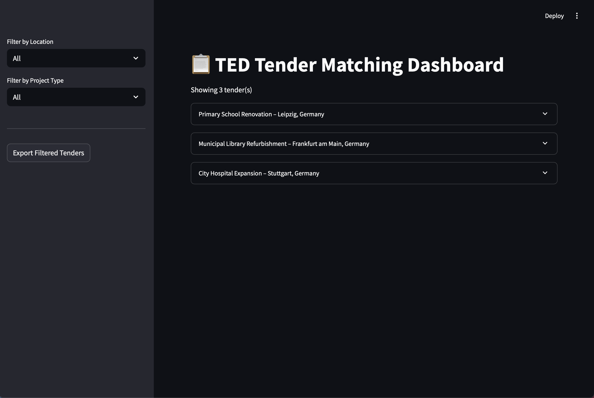
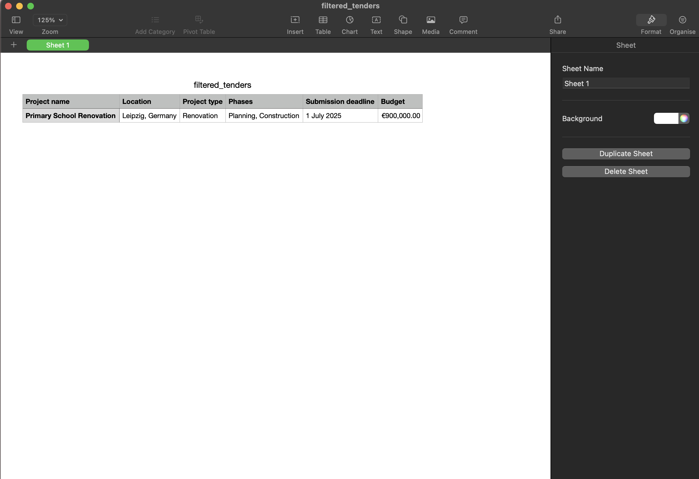

# 📋 TED Tender Matching Dashboard

A **Streamlit** dashboard that displays **TED tenders**, filters them by **location** and **project type**, shows the **top 3 most relevant project matches**, and allows **CSV export** of filtered tenders. Also includes a **daily automation simulation** to update tenders from a `new_tenders` folder.

---

## Features

- Filter tenders by **Location** and **Project Type**
- View **top 3 matching reference projects** with scores and justifications
- **Export** filtered results as CSV
- Automatically process and integrate **new tenders**
- Optional **daily update scheduler** using Python's `schedule` library

---

## Setup Instructions

1. **Clone the Repository**

```bash
git clone https://github.com/yourusername/tender-matcher.git
cd tender-matcher
```

2. **Create and Activate a Virtual Environment**

```bash
python -m venv venv
source venv/bin/activate  # On Windows: venv\Scripts\activate
```

3. **Install Required Packages**

```bash
pip install -r requirements.txt
```

---

## Running the Dashboard

Start the Streamlit app:

```bash
streamlit run app/dashboard.py
```

Navigate to `http://localhost:8501` in your browser.

---

## Adding New Tenders

1. Drop new tender JSON files in:

```
data/tenders/
```

2. Run the processing script:

```bash
python tender.py
```

This will:
- Add new tenders to `tenders_with_matches.json`
- Remove processed files from the folder

---

## Daily Automation (Optional)

Use the built-in scheduler to run the update daily:

```bash
python scheduler.py
```

> Configured to run every day at **10:00 AM**. You can change the time in `scheduler.py`.

---

## Export CSV

Use the **Export Filtered Tenders** button in the sidebar to download filtered results (excluding internal metadata).

---

## Screenshot




---

## Built With

- [Streamlit](https://streamlit.io/) – Dashboard frontend
- [Pandas](https://pandas.pydata.org/) – Data handling
- [Schedule](https://schedule.readthedocs.io/) – Task scheduling
- [Python 3.8+](https://www.python.org/)

---

## Author

**Wali Yar Khan**
